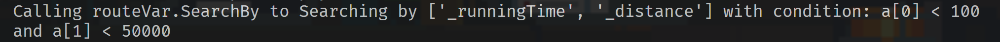
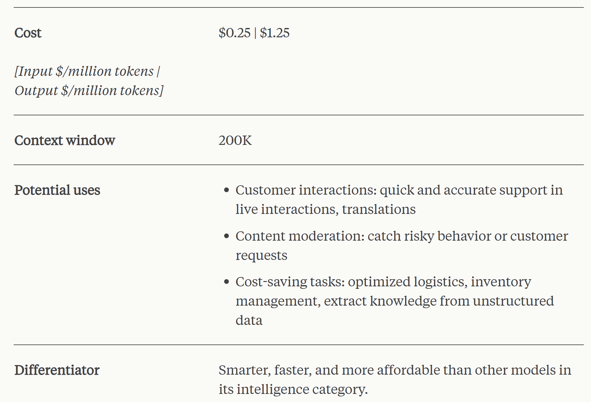

<center><h1>Technical report for solo project</h1></center>


---
## Week 05 (Finished)
### 1. Prepare the parent class
#### 1.1. Analize the given requirements

We will examine the `RouteVarQuery` and `StopQuery` classes. They share some methods.

To avoid code redundancy, we will create a parent class named `query`. Then, both `RouteVarQuery` and `StopQuery` can inherit from `Query` and only implement functions specific to their objects.


#### 1.2. Inspecting the code [`query.py`](./src/sub_modules/query.py).
The code should look like this. It will act like a data structure that manage the data being put in it.

```python
import json
import csv

class query:

    #_data should be a list of objects
    def __init__(self):
        self._list = []


    def push(self, element): #insert sigle element
        #detail is in the code
        pass

    def load(self, elements): # insert a list to query
        #detail is in the code
        pass

    def searchBy(self, atts, messageCond, className): #list att
        def cond(a, conditions):
            #detail of this functions is in the code
        #detail is in the code
        pass

    def outputAsCSV(self, _datas, dest, fields):
        #detail is in the code
        pass

    def outputAsJSON(self, _datas, dest):
        #detail is in the code
        pass
```

##### 1.2.1. `push` and `load` functions.
Because the class will be uses to manage a list of objects, so these functions will let users append new elements into our structure.

##### 1.2.2. `searchBy(seft, atts, messageCond, className)` functions.

We are required to search by prompting, so I think it is best to make the condition to be customizable.

Due to the data set is not so big, linear search might be just enough. And the `cond(a, conditions)` will be a function that can evaluate the a string conditions.

My plan is to use some LLM to process the prompting and extract the conditions and the attributes for me then I would process that result base on the desires of user want to find by locations, times, ect....

For example: By runing the following script will give us a list, and some log messages.
```python
searchBy(["_runningTime", "_distance"], "a[0] < 100 and a[1] < 50000", "routeVar")
```
*output:*


##### 1.2.3. `outputAsCSV` and `outputAsJSON`.
These functions are uses to output the desired format for user.

### 2. Working with [`vars.json`](./data/vars.json) file.
#### 2.1. Analize the given file.

The file contain some lists, each in one row, and may contain, zero or more the info of some bus routes, and its variations.

**Importain properties:**
- `RouteId`: the id of the bus route
- `RouteVarId`: the id of route variations

These properties give us a clear understand how the data is organized in `vars.json` file.

#### 2.2. Build the `RouteVar` class.

A simple class with every properties of a route variation.

To avoid accidentally modify any of the properties, every properties will be protected. So they will only be access through a getter function (those functions will be implemented in the code, but for the readability of this report, I will not include).

*The code is in [`route_var.py`](./src/sub_modules/route_var.py):*
```python
class RouteVar:
	def __init__(self, RouteId, RouteVarId, RouteVarName, RouteVarShortName, RouteNo, StartStop, EndStop, Distance, OutBound, RunningTime):
		self._routeId = RouteId
		self._routeVarId = RouteVarId
		self._routeVarName = RouteVarName
		self._routeVarShortName = RouteVarShortName
		self._routeNo = RouteNo
		self._startStop = StartStop
		self._endStop = EndStop
		self._distance = Distance
		self._outBound = OutBound
		self._runningTime = RunningTime
```

#### 2.3. Build the `RouteVarQuery` class.

As planed above, this class will inherit from the query class above for some of the functions. But due to the differences from the layout of each file, the `extract` function will be implemented separately.

*The code is in [`route_var_query.py`](./src/sub_modules/route_var_query.py)*
```python
from query import query
from route_var import RouteVar
import json
import csv

class RouteVarQuery(query):
    def __init__(self):
        super().__init__()

    def extract(self, dest):
        tmp = []
        with open(dest, "r", encoding="utf8") as file:
            for line in file:
                data = json.loads(line)
                for d in data: # d is a dict
                    value_of_field = []
                    for v in d:
                        value_of_field.append(d[v])
                    print(value_of_field)

                tmp.append(RouteVar(value_of_field))
        self._list = tmp
```

### 3. Working with [`stop.json`](./data/stops.json) file.

This file contains a series of stops on each line, these stop will represent the path that the bus will take, they belong to some route variations. So in each line, there are the `routeId` and `routeVarId` attached to the list of stops.

To extract the stops, I extracted the stops from the stop list of each route. Therefore, some of the stop, which are belong to multiple routes, will be duplicated and I handle that situation in the later part of this sections.

#### 3.1. Build the `stop` class.

First we need to build the `stop` class, which contains all the necessary properties of the stops.

*The code is in [`stop.py`](./src/sub_modules/stop.py)*
```python
class Stop:
    def __init__(self, StopId, Code, Name, StopType, Zone, Ward, AddressNo, Street, SupportDisability, Status, Lng, Lat, Search, Routes):
        self._stopId = StopId
        self._code = Code
        self._name = Name
        self._stopType = StopType
        self._zone = Zone
        self._ward = Ward
        self._addressNo = AddressNo
        self._street = Street
        self._supportDisability = SupportDisability
        self._status = Status
        self._lng = Lng
        self._lat = Lat
        self._search = Search
        self._routes = Routes
```

#### 3.2. Build the stop `stopQuerry` class.

This class will have the same functionalities with the above class, but with an additional `remove_duplicate` functions.

*The code is in [`stop_query.py`](./src/sub_modules/stop_query.py)*
```python
class StopQuery(query):
    def __init__(self):
        super().__init__()

    def extract(self, dest):
        # Detail implementation are in the file

    def remove_duplicate(self):
        # Detail implementation are in the file
```

#### 3.3. Two additional classes.

To get the most out of the `stops.json` file, we need to have way to manage the stops along the route variations. So I made two more classes.

The first one is to manage stops along the route, and the second one is to query each route.
```python
class RouteOfStop():
    def __init__(self, stops, RouteId, RouteVarId):
        self._stops = stops
        self._RouteId = RouteId
        self._RouteVarId = RouteVarId
```

```python

class RouteOfStopQuery(query):
    def __init__(self):
        super().__init__()

    def extract(self, dest):
        # detail implementation is in the stop_query file.
```

## Week 06
### 1. Using `pyproj` to convert a (lat, lng) to (x, y).
When working on a Geograhic Coordinate Systems, especially working on a small area, and need the data that you calculate to be as precise and effectively as possible, you might need to convert (lat, lng) coordinate to (x, y) coordinate using some converting standard.

The given data was given in (lat, lng) standard and can be ploted onto `geojson.io`, which is currently in $\texttt{WGS84}$ standard (that represent the Earth as a sphere). Therefore, using (lat, lng) to perform distance or other calculation will take a lot of effort and invole many trigonometry functions, which will dramatically decrease the performance of our programe.

So, we need first convert $\texttt{WGS84}$ to $\texttt{EPSG: 3405}$, which is northen Vietname standard, that uses the projected (lat, lng) coordinate of a sphere to the coordinate of a plane (x, y)

```python
from pyproj import Transformer
# Input CRS (geographic coordinates)
input_crs = "EPSG:4326"
# Output CRS (projected coordinate system for Vietnam)
output_crs = "EPSG:3405"  # VN-2000 / UTM zone 48N

class converter:
    def __init__(self):
        self.transformer = Transformer.from_crs(input_crs, output_crs)
    def convert(self, latitude, longitude):
        x, y = self.transformer.transform(latitude, longitude)
        return x, y
```

For the simplycity and the reuseability of the code, i will put it in a class and make it a module.

### 2. Research bout `geojson.io`.
[geojson.io](htpp://geojson.io/) is a quick, simple tool for creating, viewing, and sharing spatial data. This website uses `.geojson` format to plot the data onto it.

#### 2.1. `.geojson` format.
GeoJSON is a format for encoding a variety of geographic data structures. And this format is not so hard.
```json
{
  "type": "Feature",
  "geometry": {
    "type": "Point",
    "coordinates": [125.6, 10.1]
  },
  "properties": {
    "name": "Dinagat Islands"
  }
}
```

GeoJSON supports the following geometry types: Point, LineString, Polygon, MultiPoint, MultiLineString, and MultiPolygon. Geometric objects with additional properties are Feature objects. Sets of features are contained by FeatureCollection objects.

- The additional properties could be any of the user define properties.
- The coordinate reference system for all GeoJSON coordinates is a geographic coordinate reference system, using the World Geodetic System 1984 (WGS 84) [WGS84] datum, with longitude and latitude units of decimal degrees.
- The coordinate object can be a pair of coordinates, or a list of coordinates to represent different type of shape in geojson.
    - `Point`, need a pair of coordinate
    - `LineString`, need a list of the pair of two coordinate to represent the starting point and ending point of a string
    - `Polygon`, for a polygon with `n` vertices to be ploted, we need a list of `n + 1` point that are arranged in clockwise/counter clockwise order, with the first and the last point are the same.

- Note: the coordinate should be lng/lat in geojson

### 3. `Path` and `PathQuery` classes.
#### 3.1. `Path` class.

A path will have a list of lat/lng coordinate (Most of them are not the `STOP`) which are use to indicate the the shape of path.

```python
class path:
    def __init__(self, data):
        lat, lng, RouteId, RouteVarId = data
        self._lat = lat
        self._lng = lng
        self._RouteId = RouteId
        self._RouteVarId = RouteVarId
    # detail implementation are in the code
```
#### 3.2. `PathQuery` class.

This query class is almost the same as the previouse twos, also inherits some major functions in the `query` parent class.

```python
from path import path
from query import query
import json

class path_query(query):
    def __init__(self):
        super().__init__()

    def extract(self):
        with open("../../data/paths.json", "r", encoding="utf8") as file:
            for line in file:
                data = json.loads(line)
                self.push(path([data["lat"], data["lng"], data["RouteId"], data["RouteVarId"]]))
# Path: src/query.py
            file.close()
```

### 4.  Research about `shapely` library in python.
#### 4.1. Overview

`shapely` is a python library for working with geometric objects in two-dimensional space. It is open-source and BSD-licensed

It is usally used to create, maniplulate, and analize geometric objects like points, lines, polygons.... `shaply` provide user-friendly interface for geometric data. Therefore, it is ideal to choose `shapely` for tasks involving spatial data analysis, like:
- Finding areas and perimeters.
- Checking for geometric relationships, (intersection, containment,...).
- Performing spatial operation, (buffering, offset, ...).

#### 4.2. Usefull functions

- `object.area`: Returns the area (`float`) of the object.

- `object.bounds`: Returns a `(minx, miny, maxx, maxy)` tuple (float values) that bounds the object.

- `object.length`: Returns the length (`float`) of the object.

- `object.distance(other)`: Returns the minimum distance (`float`) to the other geometric object.
- `object.hausdorff_distance(other)`: Returns the Hausdorff distance (`float`) to the other geometric object. The Hausdorff distance between two geometries is the furthest distance that a point on either geometry can be from the nearest point to it on the other geometry.

- `object.intersection(other)`: Returns a collection of every type of intersected object.

- `object.interpolate(distance[, normalized=False])`: Return a point at the specified distance along a linear geometric object. The distance will be calculated from the starting point, *go along* with the line string (the linestring will act like a paht):
    - If the destinated point lies on the LineString, it is the length of the begining point to that point.
    - If the destinated point does not lie on the LineString, it is the length of the beginning point to a point on the linestring, such that, the point is the first closest point from the begining.
```python
from shapely import Point, LineString
ip = Point(0.5, 0.5)
line = LineString([(0, 0), (1, 0), (1, 1), (0, 1)])
dist = line.project(ip)  # dist is now 0.5 not 1.5 or 2.5
```
**Can be used to solve:** finding distance between stops.

- `object.intersection(other)` and `object.interpolate(distance[, normalized=False])` will be often use.

### 5. Research about `rtree` library in python.
#### 5.1. Overview.

RTree is a powerful spatial data management systems, which provide you with efficently spatial queries (search for nearest point, etc...).

Normally, `Rtree` will store data in form of *bounding box*, which is a box denoted by its upper-left and bottom-right corners.

Having `RTree` in this project, I will use it as a spatial database for `shapely` objects, and use it to find the nearest point from a set of points along the bus route to our current location/destination.

**Example:** storing and retrive data from rtree

```python
import rtree
idx = rtree.Index()
# Define some sample data
object1_bbox = (0, 0, 10, 10)
object2_bbox = (5, 5, 15, 15)

# Add objects to the index with unique IDs
idx.insert(1, object1_bbox)
idx.insert(22, object2_bbox)
# Define your query rectangle
query_bbox = (7, 7, 12, 12)

# Find objects intersecting the query rectangle
for item_id in idx.intersection(query_bbox):
    print(f"Found object {item_id}")
```

#### 5.2. Usefull functions
- `Index()`: Creates an R-Tree index object to manage your spatial data.
- `insert(id, bbox)`: Inserts an object into the index with a unique identifier (id) and its bounding box (bbox) of the form as the bound of above shapely's `.bounds` function.
- `insert_many(iterable)`: Efficiently inserts multiple objects from an iterable (like a list) into the index.
- `intersection(bbox)`: Performs an intersection search, returning IDs of objects whose bounding boxes intersect with the specified query rectangle (bbox).
- `nearest(point, n=1)`: Finds the nearest n objects (default: 1) to a given query point. Returns a list of tuples containing (ID, distance).
- `delete(id, bbox=None)`: Removes an object from the index identified by its ID and optionally its bounding box (if available).
- `write(filename)` and `read(filename)`: Persist the R-Tree data to a file (filename) for later loading.

#### 5.3. Using Rtree with shapely.

Because rtree manages geometry objects as bounding boxes, so when we insert an shapyly object to rtree, we need to in search its bounding.

```python
from rtree import Index
import rtree
import shapely.geometry as sg


# Define some Shapely geometries
point = sg.Point(10, 20)
line = sg.LineString([(5, 5), (15, 15)])
polygon = sg.Polygon([(0, 0), (10, 0), (10, 10), (0, 10)])

# Create an R-Tree index
idx = Index()

# Add the geometries to the index
idx.insert(1, point.bounds, obj=point)
nearest_geometry = idx.nearest((10, 10, 20,     20), 1)
print(list(nearest_geometry))  # Find the nearest geometry to a points in a list of index
# Output: [1]
```

### 6. Using large language models
#### 6.1. Overview

To know to use what function to search by prompting, I will need a language model for understanding what user want to find.

After took a look at some common models's pricing, I choose the "Claude 3 - Haiku" model, here is the pricing.


#### 6.2. Using the model to prompting.

For privarcy reasons, I will story some sensitive information, my API key, in a `.env` file.

```python
import anthropic
import dotenv
import os

dotenv.load_dotenv()
anthropic_api_key = os.getenv("ANTHROPIC_API_KEY")
client = anthropic.Anthropic(
    api_key=anthropic_api_key,
)

message = client.messages.create(
    model="claude-3-opus-20240229",
    max_tokens=1000,
    temperature=0.0,
    system="Respond only as short as possible.",
    messages=[
        {"role": "user", "content": "How are you today?"}
    ]
)

print(message.content)
```

**The respone:**
```
[ContentBlock(text="I'm doing well, thank you for asking! As an AI language model, I don't have feelings, but I'm functioning properly and ready to assist you with any questions or tasks you may have. How can I help you today?", type='text')]
```

#### 6.3.

## Week 07

In this week's assignments I need to build graph, and doing a shortest path finding algorithm on this graph.

*Things to plan out:*
- Graph structure
- Graph logic, construction, considered point...

*To do:*
- Extract and build graph.
- plan to construct the graph, step by step

## References
(to learn mor about geographical coordinates info)[https://8thlight.com/insights/geographic-coordinate-systems-101]
(Using shapely)[https://shapely.readthedocs.io/en/stable/manual.html#general-attributes-and-methods]